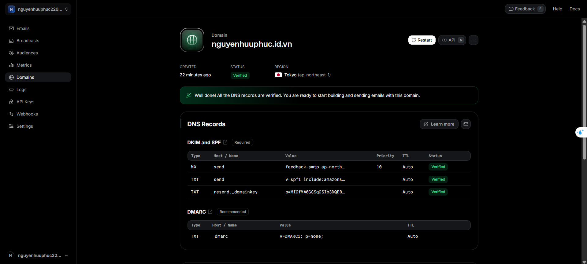

# Resend Email Service Integration Guide for NestJS

## Overview

[Resend](https://resend.com/) is a modern email delivery platform designed for developers. It provides a simple API for sending transactional emails, supports advanced features like domain authentication (DKIM, SPF, DMARC), and offers robust analytics and deliverability tools. Integrating Resend with your NestJS backend enables you to send reliable, authenticated emails for user registration, password resets, notifications, and more.

---

## Why Use Resend?

- **Developer-Friendly API:** Simple REST API and SDKs for popular languages.
- **High Deliverability:** Authenticated sending (DKIM, SPF, DMARC) to maximize inbox placement.
- **Analytics:** Track delivery, opens, clicks, and bounces.
- **Templates:** Manage and reuse email templates.
- **Scalability:** Handles large volumes with ease.
- **Security:** Supports domain verification and sender authentication.

---

## Domain Verification (nguyenhuuphuc.id.vn)

### Why Verify Your Domain?

- **Required for Custom Sending:** You must verify your domain to send emails from addresses like `noreply@nguyenhuuphuc.id.vn`.
- **Prevents Spoofing:** Ensures only authorized senders can use your domain.
- **Improves Deliverability:** Authenticated emails are less likely to be marked as spam.
- **Enables DKIM/SPF/DMARC:** These records prove your emails are legitimate.

### What Happens If You Don't Verify?

- **Cannot Send as Your Domain:** You can only send from default Resend addresses (e.g., `onboarding@resend.dev`).
- **Emails May Be Blocked:** Many providers will reject or mark as spam any unauthenticated emails.
- **No Brand Trust:** Recipients see generic sender addresses, reducing trust.

---

## How to Verify Your Domain (nguyenhuuphuc.id.vn)

1. **Add Domain in Resend Dashboard:**
   - Go to [Resend Domains](https://resend.com/domains) and add your domain (My domain is `nguyenhuuphuc.id.vn`, so that i will use it for example).
2. **Add DNS Records:**
   - Log in to your DNS provider (e.g., Tenten, Cloudflare, Namecheap,...).
   - Add the following records:

| Type | Name/Host          | Value                                                                | Priority | TTL  |
| ---- | ------------------ | -------------------------------------------------------------------- | -------- | ---- |
| MX   | send               | feedback-smtp.ap-northeast-1.amazonses.com                           | 10       | Auto |
| TXT  | send               | v=spf1 include:amazonses.com ~all                                    | -        | Auto |
| TXT  | resend.\_domainkey | p=MIGfMA0GCSqGSIb3DQEBAQUAA4GNADCBiQKBgQDFKJU/6PnmVM64bZVCtQNDu+l... | -        | Auto |
| TXT  | \_dmarc            | v=DMARC1; p=none;                                                    | -        | Auto |

3. **Wait for Verification:**
   - DNS changes may take a few minutes to several hours.
   - Resend will automatically detect and verify the records.
4. **Start Sending:**
   - Once verified, you can send emails from any address at your domain.

After verify domain


---

## Key Features of Resend

- **API & SDKs:** REST API, Node.js SDK, and more.
- **Email Templates:** Create and manage templates in the dashboard.
- **Analytics:** Real-time tracking of delivery, opens, clicks, bounces.
- **Webhooks:** Receive notifications for delivery events.
- **Suppression List:** Manage unsubscribes and bounces.
- **Multiple Domains:** Manage and send from multiple domains.

---

## Using Resend in NestJS

### 1. Install Resend SDK

```bash
pnpm add resend
```

### 2. Configure Resend in Your Service

```typescript
// src/modules/email/email.service.ts
import { Injectable } from '@nestjs/common'
import { Resend } from 'resend'

@Injectable()
export class EmailService {
  private resend = new Resend(process.env.RESEND_API_KEY)

  async sendWelcomeEmail(to: string, name: string) {
    await this.resend.emails.send({
      from: 'noreply@nguyenhuuphuc.id.vn',
      to,
      subject: 'Welcome to Our Platform',
      html: `<p>Hello ${name}, welcome!</p>`,
    })
  }
}
```

### 3. Set Your API Key

- Add your Resend API key to your environment variables:

```
RESEND_API_KEY=your_resend_api_key_here
```

### 4. Use in Your Controllers

```typescript
// ...existing code...
constructor(private readonly emailService: EmailService) {}

async registerUser(dto: RegisterDto) {
  // ...user creation logic...
  await this.emailService.sendWelcomeEmail(dto.email, dto.name);
}
```

---

## Notes & Best Practices

- **Always Verify Your Domain:** Unverified domains cannot send as custom addresses.
- **DKIM/SPF/DMARC:** Ensure all DNS records are correct for best deliverability.
- **API Key Security:** Never expose your API key in frontend code or public repos.
- **Error Handling:** Always handle errors from the Resend API (e.g., invalid addresses, rate limits).
- **Testing:** Use sandbox/test mode for development to avoid sending real emails.
- **Compliance:** Respect unsubscribe requests and privacy laws (GDPR, CAN-SPAM).

---

## Troubleshooting

- **Domain Not Verified:** Double-check DNS records and wait for propagation.
- **Emails Not Delivered:** Check spam folder, verify DKIM/SPF/DMARC, and review analytics in Resend dashboard.
- **API Errors:** Ensure your API key is correct and has permissions.

---

## References

- [Resend Documentation](https://resend.com/docs)
- [Resend Node.js SDK](https://www.npmjs.com/package/resend)
- [DKIM, SPF, DMARC Explained](https://postmarkapp.com/guides/dkim-spf-dmarc)

---

_This guide was generated for the domain `nguyenhuuphuc.id.vn` and NestJS integration. Update values as needed for your own project._
